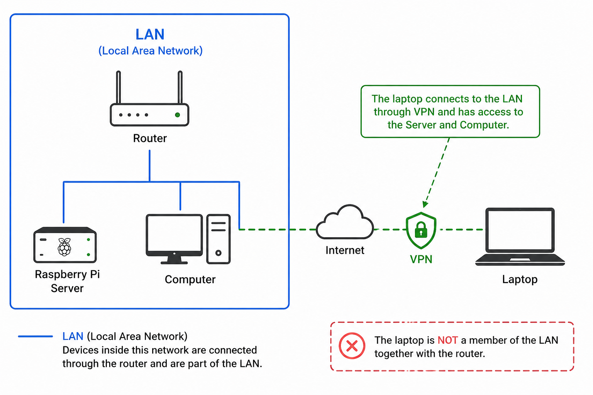

# 🏠 Remote-Home-Lab

[](https://tailscale.com)
[](https://www.raspberrypi.com)
[](https://www.kali.org)
[](https://learn.microsoft.com/en-us/windows-server/remote/remote-desktop-services/welcome-to-rds)
[]()
[](LICENSE)

> **Your home is always with you — no matter where you are.**

Access, control, and power your home computer from anywhere in the world. No static IP. No expensive hardware. No unnecessary power consumption. Just freedom and full secure access to your home devices.

---

## 👍 Is this cool?

Let me say a few words — this is something that will genuinely set you apart. For some it will be curiosity, for others inspiration. From my own experience I was able to work on my projects, job, bots, and even play games on an old MacBook 12 from 2015 (had to install Sonoma via OpenCore). It's a fascinating and practical experience in orchestrating and configuring your own architecture. If you're a System Administrator or IT Engineer — this is exactly what you need. Only you decide what kind of system you want.

---

## 💡 Concept

Modern work takes us away from home — business trips, travel, relocation. But your powerful home PC stays behind. This project solves exactly that: **turn your home network into a remote-accessible lab** that you control from your phone or laptop, from any corner of the world — while keeping the freedom to scale to more devices and services whenever you want.

The idea is built on three principles (and a bit of CIA):

- **Freedom** — SSH into your Pi, wake your PC, connect via RDP — all from your iPhone in a hotel room
- **Efficiency** — your powerful PC is off when you don't need it, on when you do. No idle power waste
- **Scalability** — start with one Pi and one PC. Grow into a full self-hosted home infrastructure
- **Security** — closed encrypted network via WireGuard with UFW and fail2ban configured. Covers the majority of attacks and threats

---

## ❓ Why this setup?

### The Problem
- No static IP address (standard for most home ISPs)
- Need to power on/off a remote PC
- Need full screen access to a Windows desktop
- Must work from any device, anywhere
- Has to be cheap

### Why not alternatives?

| Solution | Cost | No Static IP | Wake on LAN | Full Control |
|---|---|---|---|---|
| **This setup** | ~$0/mo | ✅ Tailscale | ✅ via Pi | ✅ |
| TeamViewer / AnyDesk | $50+/mo | ✅ | ❌ | ⚠️ |
| VPS + OpenVPN | $5+/mo | ✅ | ❌ | ✅ |
| Port forwarding | $0 | ❌ needs static IP | ⚠️ | ✅ |
| Leave PC always on | $0 | ✅ | — | ✅ |

Leaving your PC always on costs roughly **$25–40/month** in electricity. This setup lets you turn it on only when needed.

---

## ⚡ Power Consumption

| Device | Consumption | Monthly Cost (~$0.15/kWh) |
|---|---|---|
| Raspberry Pi 5 | ~5–12W (always on) | ~$0.50–1.00 |
| PC (idle) | ~80–150W | ~$9–17 |
| PC (load) | ~150–220W | ~$17–25 |
| PC (off) | ~0.5W (WoL standby) | ~$0.05 |

**Conclusion:** Pi runs 24/7 (~$1/mo). PC turns on only when needed. Total savings vs always-on PC: **$15–25/month**.

---

## 🌐 How It Works

### Example


### Connection Flow
```
Your Device (anywhere)
        │
        ▼ Tailscale (WireGuard encrypted)
        │
Raspberry Pi (always on, ~5W)
        │
        ├──── SSH  ──────► Pi terminal
        │
        ├──── WoL  ──────► Wake up PC
        │
        └──── RDP via Tailscale ──► PC desktop (Windows)
```

### Example IP Addresses
```
Local network:    192.168.50.0/24
Raspberry Pi:     192.168.50.150  /  Tailscale: 100.x.x.10
Home PC:          192.168.50.100  /  Tailscale: 100.x.x.11
Your laptop:                         Tailscale: 100.x.x.50
```

---

## 🛠 Minimum Setup

### Requirements
- Raspberry Pi (any model with network) running Linux
- Home PC with Wake-on-LAN enabled in BIOS
- PC connected via **Ethernet** (WoL doesn't work reliably over WiFi)
- [Tailscale](https://tailscale.com) account (free)

### Quick Start

**1. Install Tailscale on Pi**
```bash
curl -fsSL https://tailscale.com/install.sh | sh
sudo tailscale up
```

**2. Install Tailscale on your PC and all client devices**

Download from [tailscale.com/download](https://tailscale.com/download) and log in with the same account.

**3. Enable Wake-on-LAN on Pi**
```bash
sudo apt install wakeonlan -y
```

Find your PC's MAC address (on Windows):
```cmd
ipconfig /all
# Look for "Physical Address" on your Ethernet adapter
```

Wake your PC from Pi:
```bash
wakeonlan XX:XX:XX:XX:XX:XX
```

**4. Connect via RDP**

On your PC: `Win + R` → `sysdm.cpl` → Remote → Enable remote connections.

Then from any device, open an RDP client and connect to your PC's Tailscale IP (`100.x.x.x`).

**5. Secure your Pi**
```bash
# Install firewall
sudo apt install ufw -y
sudo ufw default deny incoming
sudo ufw default allow outgoing
sudo ufw allow ssh
sudo ufw enable

# Install fail2ban
sudo apt install fail2ban -y
sudo systemctl enable fail2ban --now
```

> 📄 Detailed guides in [`docs/`](docs/)

---

## 📈 Scale It Up

This setup is just the beginning. Here's where it can go:

| Level | What to add | What you get |
|---|---|---|
| **Starter** | Pi + WoL + Tailscale | Remote PC access |
| **Intermediate** | VNC on Pi, multiple PCs | Full GUI on Pi, manage multiple machines or IoT |
| **Advanced** | Docker, Nginx, Nextcloud | Self-hosted cloud, media server |
| **Full Lab** | More Pi's, NAS, smart home | Complete home infrastructure |

---

## 📱 Access From Anywhere

| Device | SSH (Pi) | RDP (PC) | WoL |
|---|---|---|---|
| iPhone / Android | [Termius](https://termius.com) | Microsoft RDP | Via SSH or Termius |
| MacBook / Linux | Terminal | Remmina / built-in RDP | `wakeonlan` command |
| Windows | PuTTY / Windows Terminal | Built-in RDP | `wakeonlan` command |

---

## 🔒 Security

- All traffic is **end-to-end encrypted** via Tailscale (WireGuard)
- No open ports exposed to the internet
- `fail2ban` blocks brute-force SSH attempts
- `ufw` firewall — only SSH and necessary ports open
- Enable **2FA on your Tailscale account** — this is the most important step

---

## 📄 Documentation

- [Tailscale Setup](docs/en/setup-tailscale.md)
- [Wake on LAN](docs/en/setup-wol.md)
- [RDP on Windows](docs/en/setup-rdp.md)
- [Security — UFW + Fail2ban](docs/en/security.md)
- [Bonus: VNC on Pi](docs/en/setup-vnc.md)

---

## 📜 License

MIT — do whatever you want with it.

---

*Built out of necessity during a business trip. Works like a clock — but you can make it something more.*
