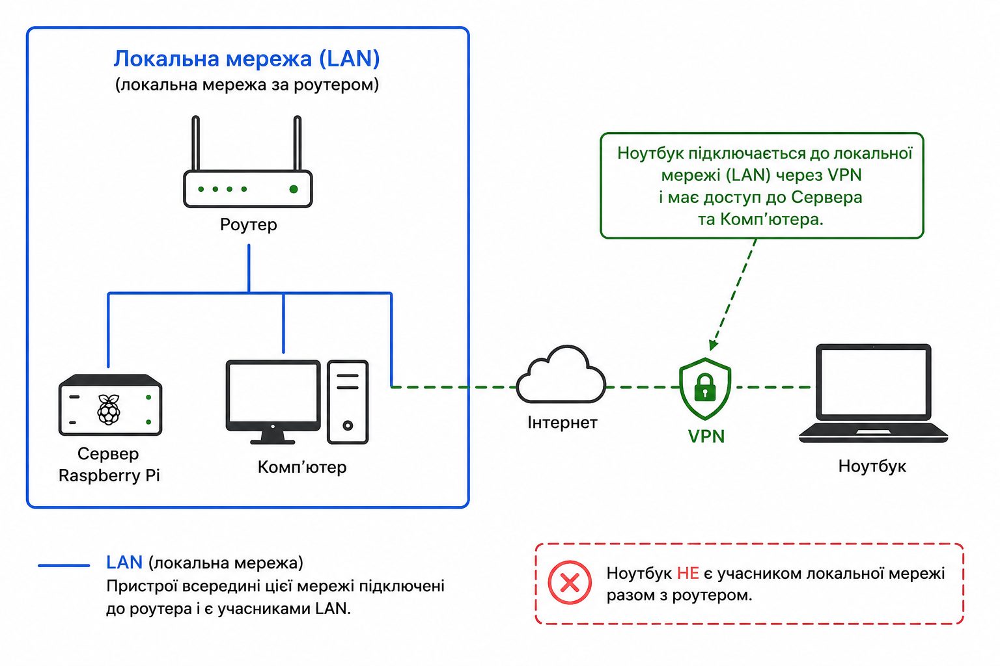

# 🏠 Remote-Home-Lab

[](https://tailscale.com)
[](https://www.raspberrypi.com)
[](https://www.kali.org)
[](https://learn.microsoft.com/en-us/windows-server/remote/remote-desktop-services/welcome-to-rds)
[]()
[](LICENSE)

> **Твій дім завжди з тобою — де б ти не був.**

Отримай доступ, керуй і вмикай домашній комп'ютер з будь-якої точки світу. Без статичного IP. Без дорогого обладнання. Без зайвих витрат електроенергії. Тільки свобода та повний безпечний доступ до твоїх домашніх пристроїв.

---

## 👍 Це круто?

Тут буде трохи слів від мене і перше що я хочу сказати — це те, що буде вас дійсно виділяти серед багатьох людей. Для когось з дивиною або натхненням. З мого досвіду я міг працювати над своїми проектами, роботою, ботами, та грати в ігри на старенькому MacBook 12 2015 (довелось ставити Sonoma через OpenCore). Це дуже цікавий і практичний досвід з оркестрації та налаштування своєї власної архітектури. Якщо ти System Administrator або IT Engineer — це те що тобі потрібно. Лише ти вирішуєш яка тобі потрібна система.

---

## 💡 Концепція

Сучасна робота забирає нас з дому — відрядження, подорожі, переїзди. Але потужний домашній ПК залишається позаду. Цей проєкт вирішує саме це: **перетвори домашню мережу на віддалену лабораторію**, якою керуєш з телефону або ноутбука, з будь-якого куточка світу, але залишає за вами право масштабування більшої кількості ваших пристроїв або сервісів.

Ідея побудована на трьох принципах (і трохи CIA):

- **Свобода** — SSH на Pi, увімкни ПК, підключись через RDP — все з iPhone у готельному номері
- **Ефективність** — потужний ПК вимкнений коли не потрібен, увімкнений коли треба. Жодних зайвих витрат
- **Масштабованість** — починай з одного Pi і одного ПК. Рости до повноцінної домашньої інфраструктури
- **Безпечність** — закрита зашифрована мережа по технології WireGuard з налаштованим UFW та fail2ban. Закриває більшу частину атак і небезпек

---

## ❓ Чому саме це рішення?

### Проблема
- Немає статичного IP (стандарт для більшості домашніх провайдерів)
- Потрібно вмикати/вимикати ПК віддалено
- Потрібен повний доступ до екрану Windows
- Має працювати з будь-якого пристрою, будь-де
- Треба щоб було дешево

### Чому не альтернативи?

| Рішення | Вартість | Без статичного IP | Wake on LAN | Повний контроль |
|---|---|---|---|---|
| **Цей сетап** | ~$0/міс | ✅ Tailscale | ✅ через Pi | ✅ |
| TeamViewer / AnyDesk | $50+/міс | ✅ | ❌ | ⚠️ |
| VPS + OpenVPN | $5+/міс | ✅ | ❌ | ✅ |
| Пробрасування портів | $0 | ❌ потрібен статичний IP | ⚠️ | ✅ |
| Залишити ПК увімкненим | $0 | ✅ | — | ✅ |

Залишати ПК увімкненим постійно коштує приблизно **$25–40/місяць** електрики. Цей сетап дозволяє вмикати його лише тоді, коли потрібно.

---

## ⚡ Споживання електроенергії

| Пристрій | Споживання | Вартість на місяць (~$0.15/кВт·год) |
|---|---|---|
| Raspberry Pi 5 | ~5–12Вт (завжди увімкнений) | ~$0.50–1.00 |
| ПК (idle) | ~80–150Вт | ~$9–17 |
| ПК (навантаження) | ~150–220Вт | ~$17–25 |
| ПК (вимкнений) | ~0.5Вт (WoL standby) | ~$0.05 |

**Висновок:** Pi працює 24/7 (~$1/міс). ПК вмикається лише коли потрібен. Економія порівняно з постійно увімкненим ПК: **$15–25/місяць**.

---

## 🌐 Як це працює

### Приклад


### Схема підключення
```
Твій пристрій (будь-де)
        │
        ▼ Tailscale (зашифровано через WireGuard)
        │
Raspberry Pi (завжди увімкнений, ~5Вт)
        │
        ├──── SSH  ──────► термінал Pi
        │
        ├──── WoL  ──────► вмикаємо ПК
        │
        └──── RDP через Tailscale ──► робочий стіл Windows
```

### Приклади IP-адрес
```
Локальна мережа:  192.168.50.0/24
Raspberry Pi:     192.168.50.150  /  Tailscale: 100.x.x.10
Домашній ПК:      192.168.50.100  /  Tailscale: 100.x.x.11
Твій ноутбук:                        Tailscale: 100.x.x.50
```

---

## 🛠 Мінімальний сетап

### Що потрібно
- Raspberry Pi (будь-яка модель з мережею) під керуванням Linux
- Домашній ПК з увімкненим Wake-on-LAN у BIOS
- ПК підключений через **Ethernet** (WoL ненадійно працює через WiFi)
- Акаунт [Tailscale](https://tailscale.com) (безкоштовно)

### Швидкий старт

**1. Встановити Tailscale на Pi**
```bash
curl -fsSL https://tailscale.com/install.sh | sh
sudo tailscale up
```

**2. Встановити Tailscale на ПК і всіх клієнтських пристроях**

Завантажити з [tailscale.com/download](https://tailscale.com/download) і увійти в той самий акаунт.

**3. Налаштувати Wake-on-LAN на Pi**
```bash
sudo apt install wakeonlan -y
```

Знайти MAC-адресу ПК (на Windows):
```cmd
ipconfig /all
# Шукай "Physical Address" на адаптері Ethernet
```

Вмикаємо ПК з Pi:
```bash
wakeonlan XX:XX:XX:XX:XX:XX
```

**4. Підключитись через RDP**

На ПК: `Win + R` → `sysdm.cpl` → Remote → увімкнути remote connections.

Потім з будь-якого пристрою відкрий RDP клієнт і підключись до Tailscale IP ПК (`100.x.x.x`).

**5. Захистити Pi**
```bash
# Встановити файрвол
sudo apt install ufw -y
sudo ufw default deny incoming
sudo ufw default allow outgoing
sudo ufw allow ssh
sudo ufw enable

# Встановити fail2ban
sudo apt install fail2ban -y
sudo systemctl enable fail2ban --now
```

> 📄 Детальні гайди в папці [`docs/`](docs/)

---

## 📈 Масштабування

Цей сетап — лише початок. Ось куди можна рости:

| Рівень | Що додати | Що отримаєш |
|---|---|---|
| **Старт** | Pi + WoL + Tailscale | Віддалений доступ до ПК |
| **Середній** | VNC на Pi, кілька ПК | GUI на Pi, керування кількома машинами або IOT |
| **Просунутий** | Docker, Nginx, Nextcloud | Власне хмарне сховище, медіасервер |
| **Повна лабораторія** | Кілька Pi, NAS, розумний дім | Повна домашня інфраструктура |

---

## 📱 Доступ звідусіль

| Пристрій | SSH (Pi) | RDP (ПК) | WoL |
|---|---|---|---|
| iPhone / Android | [Termius](https://termius.com) | Microsoft RDP | Через SSH або Termius |
| MacBook / Linux | Термінал | Remmina / вбудований RDP | команда `wakeonlan` |
| Windows | PuTTY / Windows Terminal | Вбудований RDP | команда `wakeonlan` |

---

## 🔒 Безпека

- Весь трафік **наскрізно зашифрований** через Tailscale (WireGuard)
- Жодних відкритих портів в інтернет
- `fail2ban` блокує brute-force атаки на SSH
- `ufw` файрвол — відкриті лише SSH та необхідні порти
- Увімкни **2FA на акаунті Tailscale** — це найважливіший крок

---

## 📄 Документація

- [Налаштування Tailscale](docs/ua/setup-tailscale.md)
- [Wake on LAN](docs/ua/setup-wol.md)
- [RDP на Windows](docs/ua/setup-rdp.md)
- [Безпека — UFW + Fail2ban](docs/ua/security.md)
- [Бонус: VNC на Pi](docs/ua/setup-vnc.md)

---

## 📜 Ліцензія

MIT — роби що хочеш.

---

*Побудовано з необхідності під час відрядження. Працює як годинник, але ти можеш зробити з цього щось більше.*
